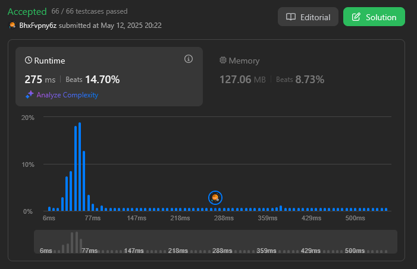

# Grafos2_GraphTravelers

**Conteúdo da Disciplina**: Grafos 2 

## Alunos
|Matrícula | Aluno |
| -- | -- |
| 22/1022014  |  João Vitor Lopes Ribeiro |
| 18/0066161  |  Luis Henrique Luz Costa |

## Sobre 
A entrega desse Trabalho de Grafos 2 da disciplina de Projeto de Algoritmos consiste em questões no leetcode sobre grafos de dificuldade média e difícil envolvendo algoritmos estudados na disciplina como algoritmo de Dijkistra para caminho mais curto e o de Kruskal para uma árvore geradora mínima.

| Questão | Dificuldade |
|---------|-------------|
| [Network Delay Time](https://leetcode.com/problems/network-delay-time/description/) | Média |
| [Find Critical and Pseudo-Critical Edges in Minimum Spanning Tree](https://leetcode.com/problems/find-critical-and-pseudo-critical-edges-in-minimum-spanning-tree/description/) | Difícil |

## Screenshots

### [Network Delay Time](https://leetcode.com/problems/network-delay-time/description/)

### [Find Critical and Pseudo-Critical Edges in Minimum Spanning Tree](https://leetcode.com/problems/find-critical-and-pseudo-critical-edges-in-minimum-spanning-tree/description/)

## Instalação 
**Linguagem**: C++ 

Os códigos foram feitos para solucionar os problemas na plataforma Leetcode, portanto é necessário ter uma conta na plataforma.

## Uso 

1. Faça Sign In na plataforma Leetcode;
2. Copie o código de solução do problema do repositório; 
3. Acesse a página do problema;
4. Cole o código no editor do Leetcode;
5. Submeta o código;
6. Receba o resultado do teste do código sob as entradas do problema.

## Entregas 
[Entrega - Grafos 2 (Acessar o vídeo)](https://youtu.be/piLu_Vc15wM)